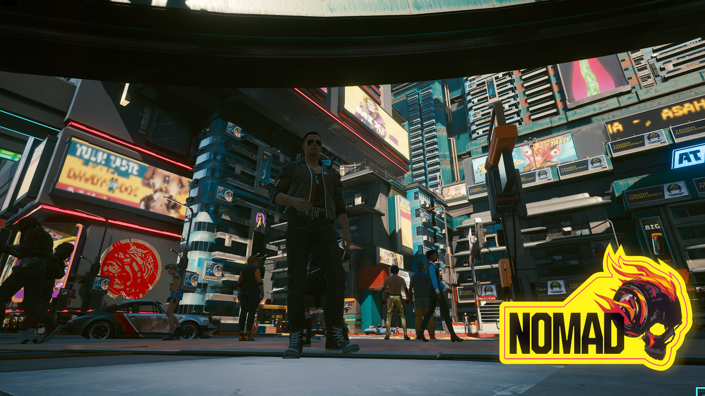
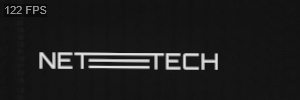
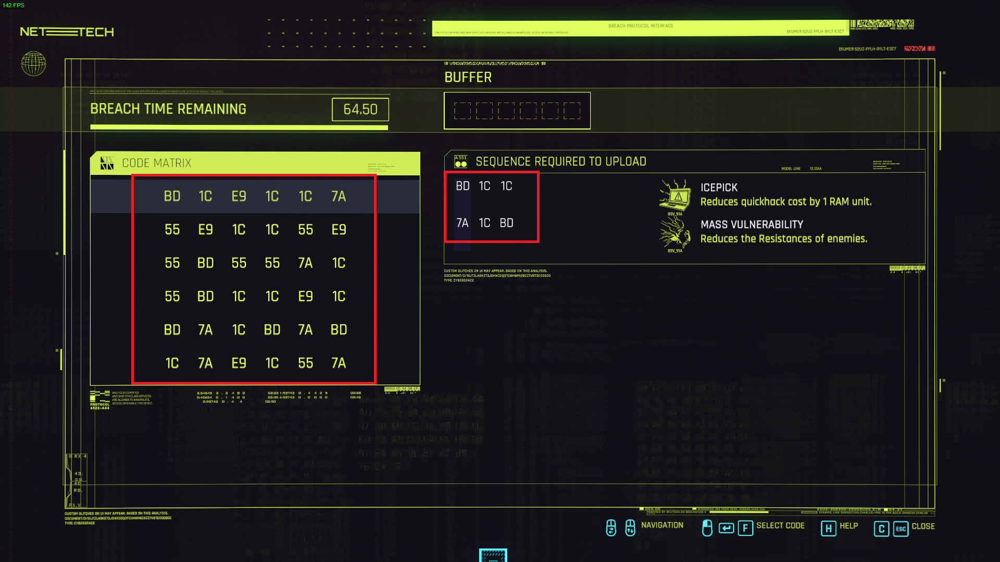
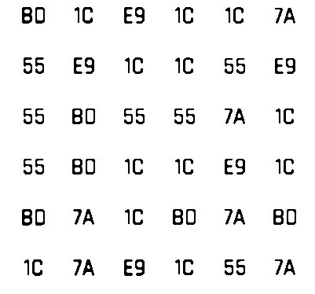
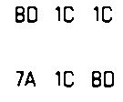

# CP2077-Breach-Protocol-Solver
Inspired by some guys on [r/cyberpunkgame](https://www.reddit.com/r/cyberpunkgame/) I did my own solver to the Breach Protocol puzzle present in Cyberpunk 2007 game.

## Video

## Method

### Taking the Screen

Thanks to [Sentdex and his awesome video about Cyberpunk] (https://www.youtube.com/watch?v=dUU6ZsJlZKQ&t=1003s&ab_channel=sentdex) I could use his source code to take screenshots from the game and read it with OpenCV.

With template matching you can recognize if the game is on the breach protocol screen, I used the NETTECH logo to check this:

*This is why in the video the solver waits some time to start. That section of the screen is dynamic and changes sometimes, so the program waits until the logo stays identical to the template.*

That way we know when to catch the code matrix and the sequences to solve:

### OCR

For the OCR (Optical Character Recognition) I used the [Tesseract](https://nanonets.com/blog/ocr-with-tesseract/) model. In the current version, this model performs best in images with black digits on white background. So we need to do some pre-processing on our image.

  
   

### Solver

I did a custom DFS (Depth First Search) algorithm that follows the game rules. 

*In the current version this solves just one of the sequences. Sometime in the future I'll be back here and improve this*

### Control

I wished for some solution that used just the game to make everything (with no third-party apps or something). So I had to interact with the game to input the commands to solve the puzzle.

Thanks again to [Sentdex](https://www.youtube.com/channel/UCfzlCWGWYyIQ0aLC5w48gBQ) I could use his script to do that.
